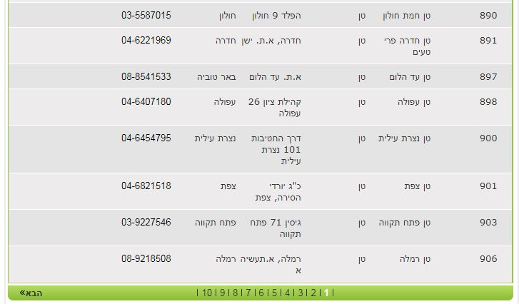
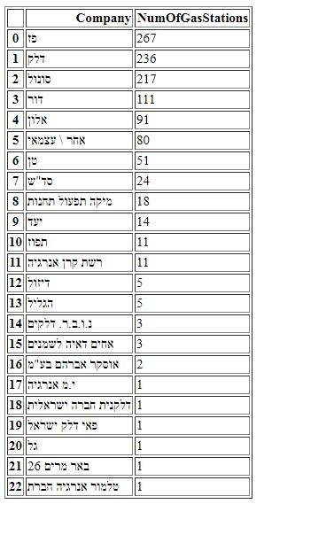

# GasScraper
Get The number of gas stations in israel by company using beautiful soup 
and show them on map using folium (version 2.0)

source site : http://archive.energy.gov.il/Subjects/Fuel/Pages/GxmsMniFuelStations.aspx

## This is how the source looks 

 

## after going throw the table and summerizing 

 

## bokhe

## folium 

googlemaps api to gather location coordinates and folium to show them on map

with slicers

